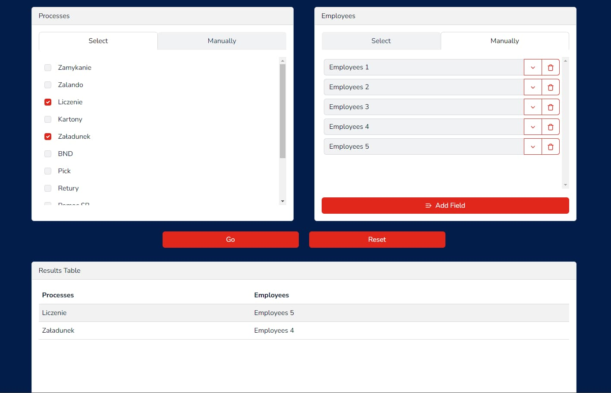

# Process Randomizer

## Project Description

Process Randomizer is a specialized application developed for the dispatch
department at the CEVA Logistics warehouse. Its main goal is to optimize the
distribution of workers across various processes in the warehouse. With this
tool, managers can automate the task assignment process, thereby increasing work
efficiency and ensuring fair distribution of workloads.

## Key Features

- **Process Selection:** The manager can choose from a list of available
  processes in the warehouse for distribution or manually enter a process if
  necessary.
- **Worker Selection:** The manager can specify a list of workers who should be
  distributed among the chosen processes, or add workers manually.
- **Randomization of Distribution:** The application automatically distributes
  the selected workers among the processes at random, thereby ensuring fair and
  efficient task distribution.
- **Results Display:** The final distribution results are presented in an
  easy-to-understand table format, ready for further use in the workflow.
